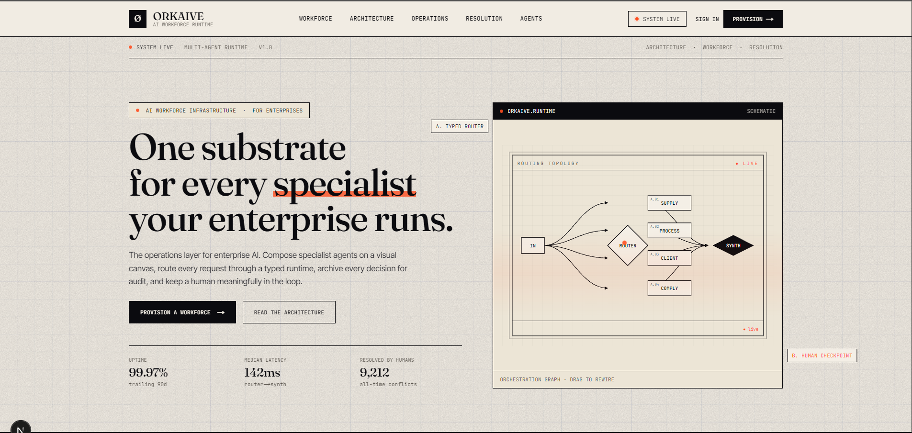
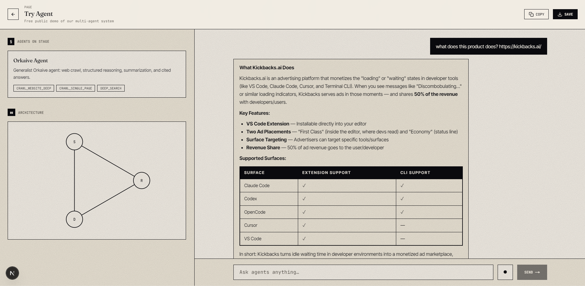
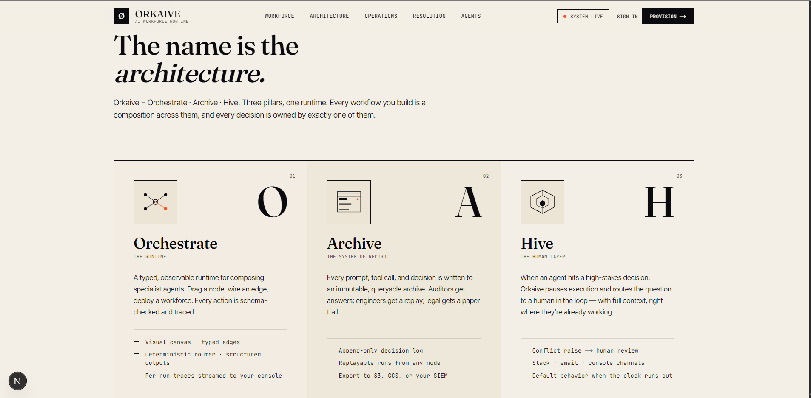
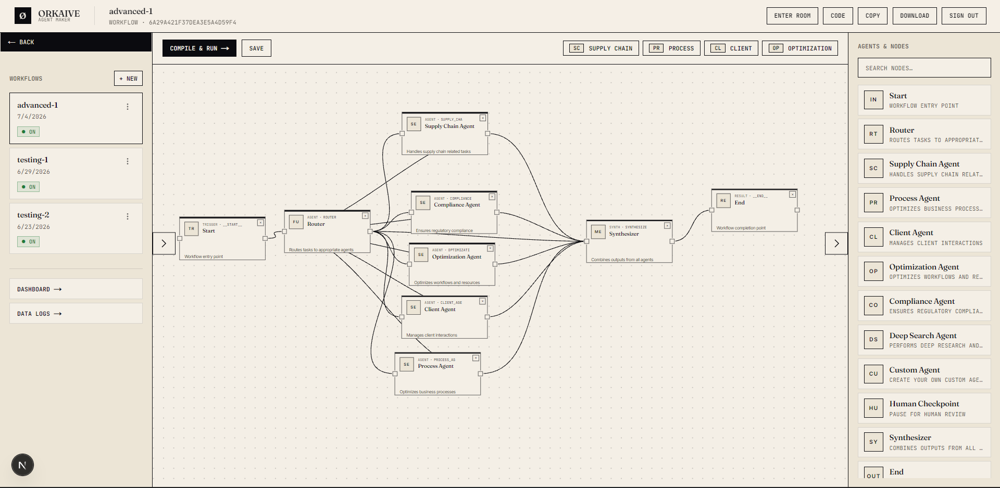
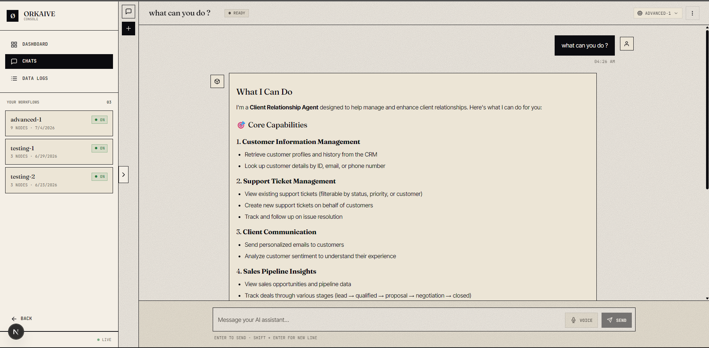

# Orkaive Frontend

**Orkaive** — Orchestrate + Archive + Hive. AI Workforce Infrastructure for Enterprises.

Next.js 16 (App Router) app for the Orkaive multi-agent platform: visual workflow builder, real-time chat surface, and the human-in-the-loop conflict UI.



## What is Orkaive?

Orkaive lets a team build a **workforce of specialist AI agents**, wire them into a workflow on a canvas, and run real queries against them. A query router classifies every prompt and dispatches it to the right agent — or several at once — and a synthesizer merges their output into one response.

When an agent hits a decision it shouldn't make alone (an approval, a missing fact, a policy call), it raises a **conflict**. The conflict is broadcast to a connected admin over WebSocket, who answers from a panel. The agent waits, then resumes with the human's response as its tool output. Every prompt, tool call, and step is archived for audit and replay.

## What this app does



A single Next.js app serving two surfaces:

- **Public** — `/`, `/try-agent`, `/ai-agents`, `/careers`, `/agent-maker`, auth pages. `/try-agent` is the free multi-agent demo: anyone can ask a question and watch the router pick an agent, stream a response, and (sometimes) trigger a conflict.
- **Authenticated** (`/dashboard`, `/chats`, `/data-logs`) — wrapped in `ProtectedRoute` → `AppShell`. The main interactive surface is `/chats`: a persistent conversation sidebar + a streaming chat over Server-Sent Events, with a per-user WebSocket for live cross-tab updates.

### The workflow builder

`/agent-maker` is the visual canvas. Drag agent nodes onto it, connect them, edit each node's system prompt and tools inline, then save the workflow. The next chat against that workflow reads the saved graph and compiles a per-workflow `StateGraph` on the backend.




### The dashboard



`/dashboard` is the authed app's home — runs, traces, and live activity for the current workspace, with realtime updates over WebSocket. `/data-logs` sits next to it for the global execution log.

## Quick start

```bash
npm install
cp .env.example .env.local       # set NEXT_PUBLIC_FASTAPI_BASE_URL
npm run dev                       # http://localhost:3000
```

## Required env

```env
NEXT_PUBLIC_FASTAPI_BASE_URL=http://localhost:8000
```

All `/api/*` browser traffic goes **directly** to FastAPI — there is no Next.js rewrite. The single entry point is `api` from `lib/axios.ts`; new code should use it instead of `fetch` or the legacy `authFetch` shim. The request interceptor attaches `Authorization: Bearer <token>`; the response interceptor redirects to `/signin` on 401.

## Stack

- **Framework:** Next.js 16 · React 19 · TypeScript
- **Styling:** Tailwind v4
- **HTTP:** axios (with a 401 → `/signin` interceptor)
- **Markdown:** react-markdown + remark-gfm + rehype-raw
- **Icons:** `react-icons/fi`
- **Path alias:** `@/*` → repo root

## Where to start

| If you want to… | Read this |
| --- | --- |
| Work on the chat UI | `agent.md` — components, hooks, the strict `MessageList` lint rule, composer modes |
| Add a new authed page | `app/(app)/chats/` is the canonical example |
| Build a new chat component | `components/chat/` — `ChatShell`, `MessageList`, `ChatComposer`, `WorkflowPickerDialog` |
| Touch HTTP calls | Use `api` from `lib/axios.ts` — never `fetch` directly, never add a Next.js proxy |
| Touch auth | `contexts/AuthContext.tsx` + `lib/axios.ts` (interceptor) |
| Understand the conflict WS | `contexts/ConflictContext.tsx` + `lib/useSocket.ts` (per-workflow conflict flow) |

## Build

```bash
npm run build
```
